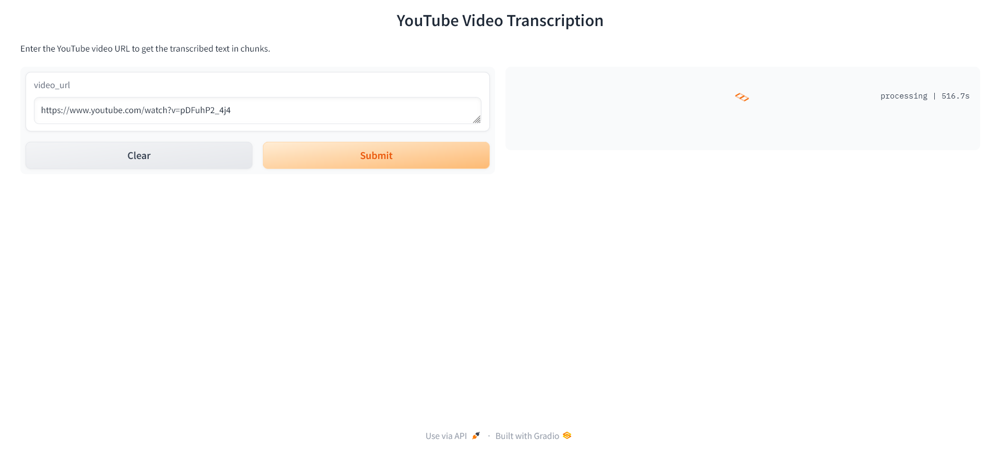

# YouTube Video Transcription 

A Python application that downloads audio from YouTube videos, transcribes it using the Whisper model, and chunks the transcription into manageable segments. The app provides a user-friendly interface powered by Gradio.

## Table of Contents

- [Features](#features)
- [Installation](#installation)
- [Usage](#usage)
- [Dependencies](#dependencies)
- [License](#license)

## Features

- **Download Audio**: Extract audio from YouTube videos.
- **Transcription**: Convert audio to text using Whisper.
- **Semantic Chunking**: Split the transcription into chunks based on duration.
- **User Interface**: Simple web-based UI to input video URL and view the transcription.



## Installation

### Prerequisites

- Python 3.7 or higher
- `ffmpeg` installed and available in the system PATH

### Steps

1. **Clone the Repository:**

    ```bash
    git clone https://github.com/jeswinbinu/YouTubeTranscriber.git
    cd YouTubeTranscriber
    ```

2. **Create and Activate Virtual Environment:**

    ```bash
    python -m venv venv
    source venv/bin/activate  # On Windows, use `venv\Scripts\activate`
    ```

3. **Install Dependencies:**

    ```bash
    pip install -r requirements.txt
    ```

4. **Download NLTK Data:**

    ```python
    import nltk
    nltk.download('punkt')
    ```

## Usage

1. **Run the Application:**

    ```bash
    python app.py
    ```

2. **Access the Interface:**

    Open your browser and navigate to [http://127.0.0.1:7860](http://127.0.0.1:7860).

3. **Transcribe a Video:**

    - Enter the YouTube video URL in the input field.
    - Click **Submit**.
    - View the transcribed text and chunks in the output area.

## Dependencies

- [pytube](https://pytube.io/en/latest/): A lightweight, dependency-free Python library for downloading YouTube videos.
- [pydub](https://pydub.com/): A Python library for manipulating audio files, including conversion and processing.
- [whisper-timestamped](https://github.com/linto-ai/whisper-timestamped): A wrapper around OpenAI's Whisper ASR model that includes timestamped transcription.
- [nltk](https://www.nltk.org/): The Natural Language Toolkit, a suite of libraries and programs for symbolic and statistical natural language processing.
- [gradio](https://www.gradio.app/): A Python library that allows you to quickly create user interfaces for machine learning models.

Install them using:
```bash
pip install -r requirements.txt
```
## License

This project is licensed under the [MIT License](LICENSE) - see the LICENSE file for details.


